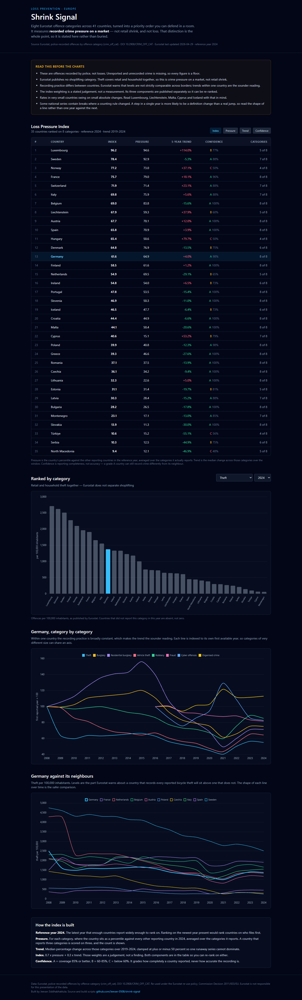

# Shrink Signal

A loss-prevention reading of European police-recorded crime. Eight Eurostat
offence categories, 41 countries, 2008 to 2024, folded into a priority order you
can defend in a room — with the reasons it might be wrong printed above the
charts rather than in a footnote.

**Live:** https://jeevan-0508.github.io/shrink-signal/



## What it measures, and what it does not

It measures **recorded crime pressure on a market**. It does **not** measure
retail shrink, and it does not measure loss.

That is not a caveat added at the end. It is the first thing on the page,
because the gap is real:

- These are offences **recorded by police**. Unreported and unrecorded crime is
  missing, so every figure here is a **floor**, never a total.
- Eurostat publishes **no shoplifting category**. Theft covers retail and
  household together, so nothing here isolates a store or a site.
- **Recording practice differs between countries.** Eurostat warns that levels
  are not strictly comparable across borders. A trend inside one country is the
  sounder reading, because the practice is broadly constant there.
- Rates in **very small countries** swing on small absolute changes. Luxembourg,
  Liechtenstein, Malta, Cyprus and Iceland need reading with that in mind.
- Some national series contain **breaks** where a counting rule changed. A step in
  a single year is more likely to be a definition change than a real jump.

Anyone who wants shrink figures needs a retail panel such as EHI or the Global
Retail Theft Barometer. Those are not open data, so they are not in here. What is
in here is public, citable and reproducible from the two scripts in `tools/`.

## The Loss Pressure Index

Three components, published separately so the ranking can be argued with rather
than taken on trust.

| Component | What it is |
| --- | --- |
| **Pressure** | Where a country sits as a percentile against every other reporting country in the reference year, averaged over the categories it actually reports |
| **Trend** | Median percentage change across those categories over the trend window, clamped at plus or minus 50 percent so one runaway series cannot dominate |
| **Confidence** | How completely the country reported — A is 85 percent or better, B is 60 to 85, C is below 60. It grades completeness, never accuracy |

Index = `0.7 x pressure + 0.3 x trend`, with the trend mapped onto the same 0-100
range. **Those weights are a judgement, not a finding**, which is why both
components sit in the table next to the score.

The reference year is the most recent year that enough countries report widely
enough to rank on — currently **2024**, with 32 countries reporting at least five
of the eight categories. Ranking on the newest year present would rank countries
on who files first.

A country is only ever scored on the categories it reported, and the count is
shown in the table. Nothing is imputed and no missing value is treated as zero.

## The eight categories

| ICCS code | Category | Why it is here |
| --- | --- | --- |
| `ICCS0502` | Theft | Retail and household together — the closest available signal, and the reason the shrink caveat exists |
| `ICCS0501` | Burglary | Includes commercial premises: break-ins at a site |
| `ICCS05012` | Residential burglary | Households only, published so the commercial share can be reasoned about |
| `ICCS05021` | Vehicle theft | Motorised vehicle or parts — yards and fleets |
| `ICCS0401` | Robbery | The violent tail of loss |
| `ICCS0701` | Fraud | Recorded fraud offences, all types |
| `ICCS0903` | Cyber offences | Acts against computer systems |
| `ICCS09051` | Organised crime | Participation in an organised criminal group |

## Germany

Germany is the country the page reads in detail, and it is one of the few that
reports **all eight categories**, with 97.9 percent coverage over the trend
window — grade **A**. It ranks **13th of 35** on the index: pressure 64.9, trend
+4.0 percent over 2019 to 2024.

Underneath that flat headline the categories move in opposite directions —
recorded theft rose from 1,235 to 1,377 per 100,000 between 2019 and 2024, while
recorded fraud fell from 1,003 to 894. A single national number would have hidden
both, which is why the per-category view exists.

## Why the latest year is 2024, and how it stays current

Eurostat publishes this dataset about once a year and runs roughly a year and a
half behind: the release of **2026-04-29** is the one that added **2024**. Asked
directly for 2025, the API returns a valid response with **zero observations** —
the year does not exist yet rather than being missing from this build. On that
cadence 2025 should appear in spring 2027.

For Germany alone, national 2025 figures do exist earlier, in the BKA's
Polizeiliche Kriminalstatistik. They are deliberately not mixed in here: BKA
counts to German rules and Eurostat harmonises across borders, so splicing them
into one line would put a definition change in the middle of a trend and invite
exactly the misreading the caveats warn about.

A monthly GitHub Action (`.github/workflows/refresh.yml`) re-pulls the API,
rebuilds the dataset, runs the verifier, and **commits only if the numbers
actually moved**. So a quiet month leaves no commit, and the day Eurostat adds
2025 the page picks it up on its own — including a new reference year, since that
is derived from the data rather than hard-coded.

## Reproducing it

```bash
python tools/1_fetch.py      # Eurostat API to data/raw/, one file per category
python tools/2_dataset.py    # builds data/crime.json and the index
python tools/verify_data.py  # 19 checks
```

`data/raw/` is gitignored. The built dataset is the artefact, and the verifier
re-derives it from the raw files, so a value cannot drift away from the source
without the suite failing.

## Verification

`python tools/verify_data.py` — 19 checks, including:

- **every value matches the raw Eurostat response** — no rounding, no reordering,
  no quiet imputation
- **the index equals its own published formula**, recomputed from the components
- ranks are a strict ordering of the score; pressure stays inside 0-100
- confidence grades follow the thresholds the dataset itself declares
- the reference year is reported by at least 20 countries
- the limitations are asserted to be **in the data**, not only in the page copy

`python tools/verify_site.py` — 11 checks in a real browser: every ranked country
reaches the table, every limitation renders, the DOI and licence are on the page,
Germany's row matches the dataset, all three charts draw, the bar chart contains
no stand-in zeros for countries that did not report, and re-sorting genuinely
re-ranks.

## Source and licence

Data: **Eurostat, police-recorded offences by offence category** (`crim_off_cat`),
DOI [10.2908/CRIM_OFF_CAT](https://doi.org/10.2908/CRIM_OFF_CAT), last updated
2026-04-29. Re-used under the Eurostat re-use policy (Commission Decision
2011/833/EU). Eurostat is not responsible for this presentation of the data.
Definitions and comparability notes:
[crim_sims](https://ec.europa.eu/eurostat/cache/metadata/en/crim_sims.htm).

Code in this repository: MIT.
